  

# 🌸 54kur4-Br33z3

> *"Code flows like petals in the wind… until the merge conflicts arrive."*

---

## 🌀 About Me
Hello, traveler of the internet. I’m **54kur4-Br33z3** – part-time dreamer, full-time tamer of rogue semicolons.  
I’m on a quest to combine **soft aesthetics** with **hard logic** — think cherry blossoms gently falling onto a mechanical keyboard.  

When I’m not coding, I’m:
- Refactoring my coffee intake pipeline ☕
- Speedrunning anime marathons 🎌
- Debugging my cat’s mysterious 3 a.m. zoomies 🐾

---

## 🛠 Tech Arsenal
- **Languages**: JavaScript, Python, Whispered HTML (don’t ask)
- **Frameworks**: React, Vue, and whatever shiny thing I found last week
- **Special Skills**: 
  - Making APIs cry in joy
  - Turning TODO comments into existential poetry
  - Keeping commits poetic yet functional

---

## 🌸 Featured Projects
| Project | Description |
|---------|-------------|
| **Petal-Parser** | Parses code & sprinkles cherry blossom emojis randomly |
| **WindyBot** | Discord bot that sends gentle reminders and passive-aggressive lint errors |
| **Zen-404** | A 404 page that gives you life advice instead of an error |

---

## 🌬 Fun Facts
- My typing speed increases by 200% if anime music is playing
- I treat `console.log` as a trusted friend, not just a tool
- I once fixed a bug by **literally walking away and making tea**

---

## 📫 Let’s Connect
💌 carrier-pigeon://sakura.breeze  
🐙 GitHub: [54kur4-Br33z3](https://github.com/54kur4-Br33z3)  
🌐 Website: [sakura-breeze.dev](https://sakura-breeze.dev) *(probably under construction)*

---

> *"May your branches stay strong, and your code always pass linting."* 🌸
